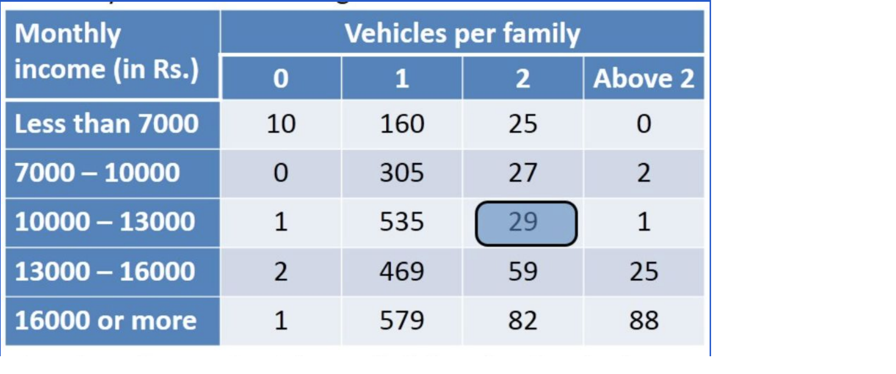

# Opis obrazu

W tym dokumencie znajdziesz kilka ćwiczeń do trenowania opisu obrazów. Dla każdego ćwiczenia otrzymasz przykładowy tekst wejściowy, a następnie oczekiwane uzupełnienie. Twoim zadaniem jest napisać prompt, który doprowadzi do uzyskania oczekiwanego wyniku.

## Ćwiczenie 1: Licznik kasków
Napisz prompt, który poda liczbę osób noszących kask.

## Ćwiczenie 2: Twierdzenie Pitagorasa
Napisz prompt, który rozwiąże zadanie przedstawione na obrazku.

## Ćwiczenie 3: Rozumienie i analiza tabeli
Napisz prompt, który wskaże, że 113 rodzin zarabia więcej niż 13000 i posiada więcej niż 2 samochody.

